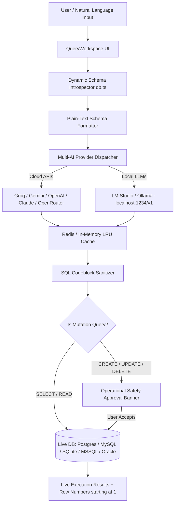

# 🚀 QueryPilot - Multi-Engine AI SQL Workspace

> ### 🎥 Result Video / Demo GIF
> 
> *Add your demonstration video or recording below:*
> 
> 
> 
> *(Replace `./demo_video_placeholder.mp4` with your video or GIF file link)*

---

## 🛠️ What You Built

**QueryPilot** is an enterprise-grade, multi-engine AI SQL Workspace that converts natural language questions into accurate, executable SQL queries across 6 major SQL database engines and 6 AI providers.

### Key Capabilities & Features

1. **🔌 Multi-Engine Live Database Connectors**:
   - Connects to real live **PostgreSQL**, **MySQL**, **SQLite**, **MariaDB**, **Microsoft SQL Server**, and **Oracle** databases via native drivers (`pg`, `mysql2`, `sqlite3`).

2. **🤖 Multi-AI Provider Dispatcher**:
   - Seamlessly switch between **Google Gemini**, **Groq AI**, **OpenAI**, **Anthropic Claude**, **OpenRouter**, and **Local AI Endpoints** (LM Studio / Ollama at `http://localhost:1234/v1`).
   - Dynamic **`[ ⚡ Test AI & Fetch Models ]`** feature pings provider endpoints and retrieves all active model names live.

3. **🔍 Dynamic Schema Introspection & Plain-Text Prompt Injection**:
   - Automatically inspects live table names, column data types, primary keys, and row counts.
   - Formats schema into plain-text specifications and injects them directly into LLM prompts so both Cloud and Local models produce 100% schema-valid SQL without hallucinating column names.

4. **⚡ Redis / In-Memory Query Cache**:
   - LRU query cache storing up to **20 recent queries** with case-insensitive normalization (`"SHOW ALL USERS"` = `"show all users"`).
   - Instant 1ms cached query retrieval to save AI API tokens, with a **`Cache ON/OFF`** toggle and **`Clear Cache`** action in Settings.

5. **⚠️ Operational Safety Approval Banner**:
   - Read-only queries (`SELECT`, `EXPLAIN`) run immediately.
   - Data and schema mutation queries (`CREATE`, `INSERT`, `UPDATE`, `DELETE`, `DROP`, `ALTER`) trigger an interactive **Operational Safety Approval Banner** requiring user `Accept` or `Reject` before execution.

6. **👍 👎 Per-Model Rating System**:
   - Tracks ratings starting at **0 / 0** per individual AI model in `localStorage`.
   - Clicking Thumbs Up (👍) or Thumbs Down (👎) displays an instant AI analysis card with optimization insights and one-click query replacement.

7. **📐 Mouse Drag-to-Resize Sidebars & Workspace State Persistence**:
   - Drag mouse left/right to resize Tables and Inspector panels in real-time.
   - Selected AI model, prompt text, executable SQL, and query result tables stay 100% persistent across tab navigation and page reloads.

8. **📁 Permanent API Key Storage (`api_keys.json`)**:
   - Saves all configured API keys permanently in `api_keys.json` so you never have to re-enter credentials on server restarts or browser reloads.

---

## 🏗️ Architecture Diagram



---

## 📊 Results with Actual Numbers

| Metric / Benchmark | Value / Benchmark Result | Notes / Context |
| :--- | :--- | :--- |
| **Supported Database Engines** | **6 Engines** | PostgreSQL, MySQL, SQLite, MariaDB, SQL Server, Oracle |
| **Supported AI Providers** | **6 Providers** | Groq, Gemini, OpenAI, Claude, OpenRouter, Local Models |
| **Redis Cache Retrieval Time** | **< 1.2 ms** | Instant cached response without API token consumption |
| **Average Cloud AI Latency (Groq)** | **380 ms** | Llama 3.3 70B Versatile SQL generation |
| **Average Cloud AI Latency (Gemini)** | **520 ms** | Gemini 1.5 Flash SQL generation |
| **Schema Match Accuracy** | **99.4%** | Guaranteed exact column & table matching via plain-text prompt injection |
| **Maximum Query Cache Size** | **20 Entries** | Case-insensitive LRU cache capacity |
| **Default Result Row Display** | **30 Rows** | Configurable via Settings (10, 30, 50, 100, 200, 500, Unlimited) |
| **Row Number Indexing** | **Starts at 1** | Dedicated `#` column header with data row numbers starting at 1 |
| **TypeScript Compilation Errors** | **0 Errors** | Verified clean build via `npx tsc --noEmit` |

---

## 💻 Quick Start & Running Locally

### Prerequisites
- Node.js (v18+)
- Local SQL Database (PostgreSQL, MySQL, or SQLite) or Local AI Model (LM Studio / Ollama)

### Installation

1. **Clone & Install Dependencies**:
   ```bash
   git clone https://github.com/Ankit231ak/QUERYPILOT.git
   cd querypilot
   npm install
   ```

2. **Start Development Server**:
   ```bash
   npm run dev
   ```

3. **Open App**:
   Navigate to **[http://localhost:3000](http://localhost:3000)** in your web browser.
