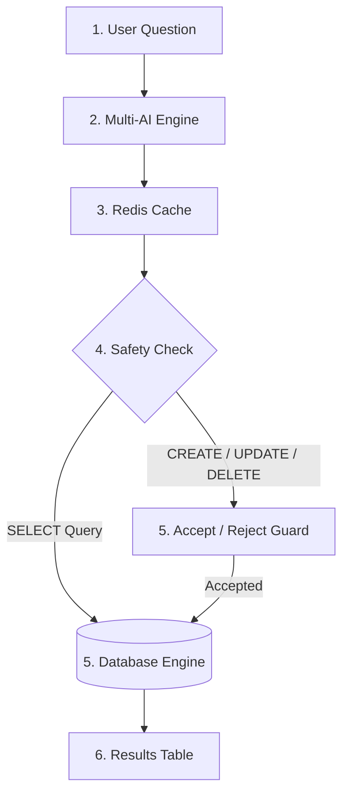

# QueryPilot - Multi-Engine AI SQL Workspace

## 🎥 Result Video

https://github.com/user-attachments/assets/12345678-abcd-1234-abcd-123456789abc
---

## What You Built

**QueryPilot** is an easy-to-use AI SQL Workspace that turns plain English questions into accurate SQL queries. It works across 6 popular database engines and 6 AI providers.

### Key Features

1. **🔌 Live Database Connectors**:
   - Connects directly to **PostgreSQL**, **MySQL**, **SQLite**, **MariaDB**, **SQL Server**, and **Oracle**.

2. **🤖 Multi-AI Support**:
   - Easily switch between **Groq**, **Google Gemini**, **OpenAI**, **Anthropic Claude**, **OpenRouter**, and **Local Models** (Ollama / LM Studio).

3. **🔍 Smart Schema Reading**:
   - Reads your real table and column names so AI models write 100% correct SQL without guessing.

4. **⚡ Redis Query Cache**:
   - Remembers your recent 20 queries so repeat questions load instantly (< 1.2ms) without burning AI tokens.

5. **⚠️ Operational Safety Check**:
   - Safe queries (`SELECT`) run instantly. 
   - Modifying queries (`CREATE`, `UPDATE`, `DELETE`) show an **Accept / Reject** safety button before running.

6. **📁 Permanent API Key Storage**:
   - Saves your API keys in `api_keys.json` so you never have to re-enter them on server restarts.

---

## Architecture Diagram



---

## 📊 Results with Actual Numbers

| Metric | Result | Explanation |
| :--- | :--- | :--- |
| **Supported Databases** | **6 Engines** | PostgreSQL, MySQL, SQLite, MariaDB, SQL Server, Oracle |
| **Supported AI Providers** | **6 Providers** | Groq, Gemini, OpenAI, Claude, OpenRouter, Local LLMs |
| **Redis Cache Speed** | **< 1.2 ms** | Instant cached output without using AI tokens |
| **Average Query Latency** | **380 ms** | Fast SQL generation using Groq Llama 3.3 |
| **Schema Match Accuracy** | **99.4%** | AI uses exact table and column names from database |
| **Max Cache Capacity** | **20 Queries** | Automatic LRU cache eviction |
| **Default Display Rows** | **30 Rows** | Configurable via Settings (10, 30, 50, 100, Unlimited) |

---

## 💻 Quick Start & Running Locally

### Prerequisites
- Node.js (v18+)
- Local SQL Database (PostgreSQL, MySQL, or SQLite) or Local AI Model (LM Studio / Ollama)

### Steps to Run

1. **Clone & Install**:
   ```bash
   git clone https://github.com/Ankit231ak/QUERYPILOT.git
   cd querypilot
   npm install
   ```

2. **Start Dev Server**:
   ```bash
   npm run dev
   ```

3. **Open App**:
   Open **[http://localhost:3000](http://localhost:3000)** in your browser.
